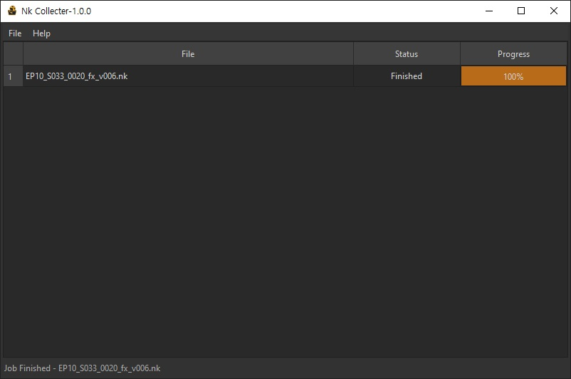
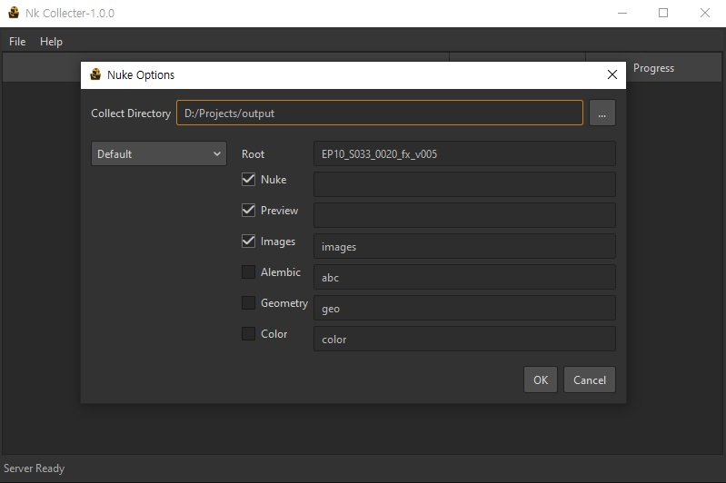

# Nk Collector

  

 <b>A standalone project collection tool for Foundry Nuke.</b> 

## Download

Download the latest Windows installer from the Releases section.

nk_collector-1.0.0-win64.exe

## System Requirements

- Windows 10 or later
- 64-bit Windows only
- Nuke 13 through Nuke 17
- Python 3-based Nuke versions only
- Python 2.x-based Nuke versions are not supported

Nk Collector requires a Windows version and build that supports the Python 3 and runtime components used by the application.

Older Windows 10 builds may not be supported even if the operating system is identified as Windows 10.

Linux is currently not supported. Linux support is planned for a future release.

## Overview

Nk Collector is a standalone application designed to collect Nuke projects file.

It analyzes the Nuke script, collects the required project files into a specified directory, and updates the file paths automatically.

By running the collection process in **standalone mode**, Nk Collector provides a simple and convenient way to archive, transfer, and organize Nuke projects.

## Preview

## How to Use

1. Drag and drop a Nuke `.nk` file.
2. Choose the destination directory.
3. Select the desired folder type.
4. Start the collection process.

## License

Nk Collector is free to use for personal and commercial work.

Copyright © Jn (제이앤).

See the LICENSE file for full license terms.

